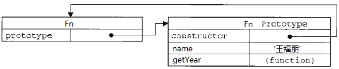

# 原型 (prototype)
### 什么是原型？
原型是一个对象，其他对象可以通过它实现属性继承。

**对象** ——若干属性的集合。

js常说一切都是对象，不过也不是所有的都是对象，值类型不是对象，String、Boolean、Number和undefinded四种类型就是值类型，不是对象。
函数、数组、对象、null、new Number(10)都是对象，它们是***引用类型***。***引用类型***指的是那些保存在堆内存中的对象，意思是，变量中保存的实际上只是一个指针，这个指针执行内存中的另一个位置，由该位置保存对象。*值类型*直接储存变量本身，而***引用类型***只是引用对象在托管堆上的内存地址。  
有个网友打的有意思的比方：钱包里有钱  这个钱包里的钱 就是值类型  可以直接买很多小东西  但是现在你要买一个很贵的东西 钱包里的钱不够  于是乎 你就要用到你钱包里的银行卡取钱    这个时候 银行就是托管堆 银行里的钱就是引用类型.

对象里面一切都是属性，没有方法，那么这样方法如何表示呢——方法也是一种属性，因为它的属性表示为*键值对*的形式。
代码如下：

        var obj={
            a:10,
            b:function fn(x){
                alert(this.a+x);
            },
            c:{
                name:'Ryan',
                year:'85后'
            }
        }

以上代码中，obj是一个自定义的对象，其中a、b、c就是它的属性，而且在c的属性值还是一个对象，它又有name、year两个属性。

话说回来，原型干嘛用？原型是函数的一个属性，JavaScript默认的给每个函数一个属性——prototype（原型）。每个函数都有这样的属性，它叫prototype。这个prototype的属性值是一个对象（属性的集合，再次强调！），默认的只有一个叫做constructor的属性，指向这个函数本身。

如上图，SuperType是是一个函数，右侧的方框就是它的原型。

原型既然作为对象，属性的集合，不可能就只弄个constructor来玩玩，肯定可以自定义的增加许多属性。例如Object，人家的prototype里面，就有好几个其他属性。

可以在自己自定义的方法的prototype中新增自己的属性

        function Fn() { }
        Fn.prototype.name = '王福朋';
        Fn.prototype.getYear = function () {
            return 1988;
        };
看到没有，这样就变成了下面

再来写code，进一步理解原型干嘛用

        function Fn() { }
        Fn.prototype.name = 'Ryan';
        Fn.prototype.getYear = function () {
            return ‘80后’;
        };

        var fn = new Fn();
        console.log(fn.name);
        console.log(fn.getYear());

即，Fn是一个函数，fn对象是从Fn函数new出来的，这样***fn对象就可以调用Fn.prototype中的属性***。

因为每个对象都有一个隐藏的属性——“`__proto__`”，这个属性引用了创建这个对象的函数的prototype。即：fn.`__proto__` === Fn.prototype

这里的"`__proto__`"成为“隐式原型”.每个对象都有一个`__proto__`属性，指向创建该对象的函数的prototype。

下面很好理解

        var foo = {
        x: 10,
        y: 20
        }; 

当我不指定`__proto__`的时候，foo也会预留一个这样的属性，

如果有明确的指向，那么这个链表就链起来啦。

很明显，下图中b和c共享a的属性和方法，同时又有自己的私有属性。

`__proto__`默认的也有指向。它指向的是最高级的object.prototype，而object.prototype的`__proto__`为空。 

        var a = {
        x: 10,
        calculate: function (z) {
        return this.x + this.y + z
        }
        };
        var b = {
        y: 20,
        __proto__: a
        };

        var c = {
        y: 30,
        __proto__: a
        };

        // call the inherited method
        b.calculate(30); // 60 

###判断神器
* 判断值类型还有Object/Function用`typeof`判断；
* 判断对象的实例用`instanceof`来判断。

Instanceof的判断规则是：沿着A（第一个变量是对象暂称A）的`__proto__`这条线来找，同时沿着B（第二个变量一般是函数）的prototype这条线来找，如果两条线能找到同一个引用，即同一个对象，那么就返回true。如果找到终点还未重合，则返回false。

Instanceof判断规则如下图所示：

##原型链
什么叫原型链？看下面代码和图便知

！[prototypeChain](images/prototype chain1.png)

以上代码中，f1是Foo函数new出来的对象，f1.a是f1对象的基本属性，f1.b是怎么来的呢？——从Foo.prototype得来，因为f1.`__proto__`指向的是Foo.prototype

**访问一个对象的属性时，先在基本属性中查找，如果没有，再沿着__proto__这条链向上找，这就是原型链。**

看图便知

！[prototypeChain](images/prototype chain2.png)

上图中，访问f1.b时，f1的基本属性中没有b，于是沿着`__proto__`找到了Foo.prototype.b。
